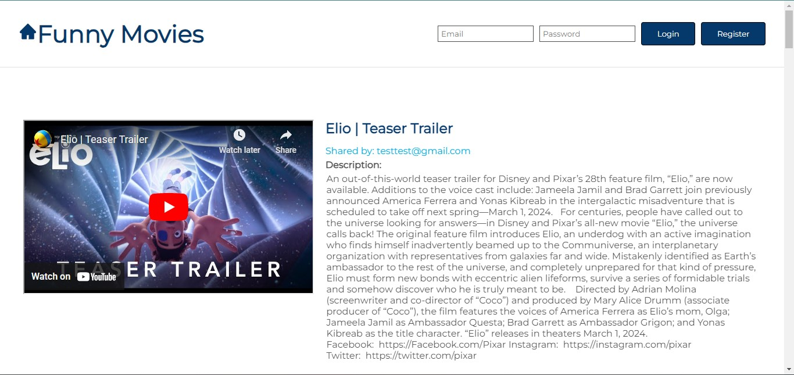
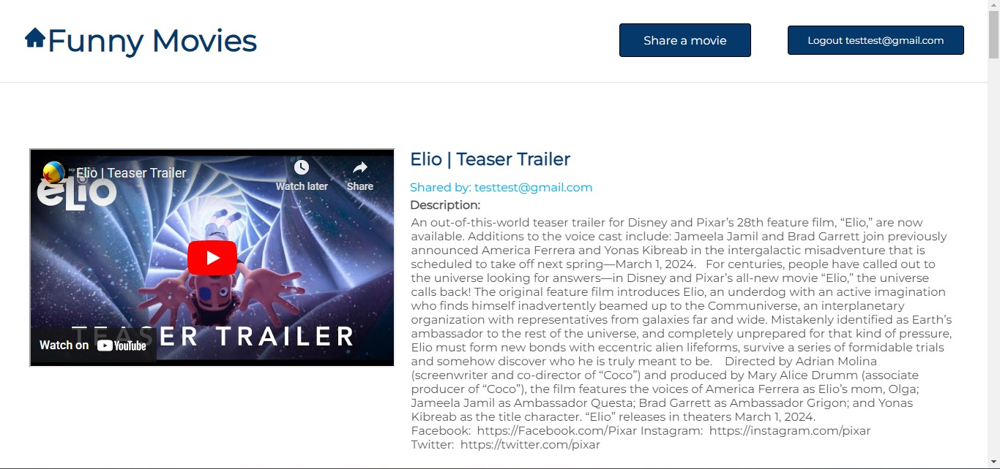
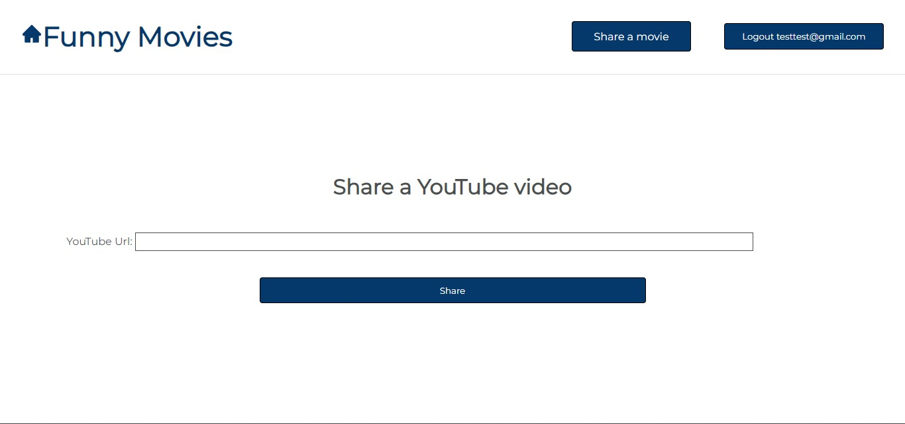
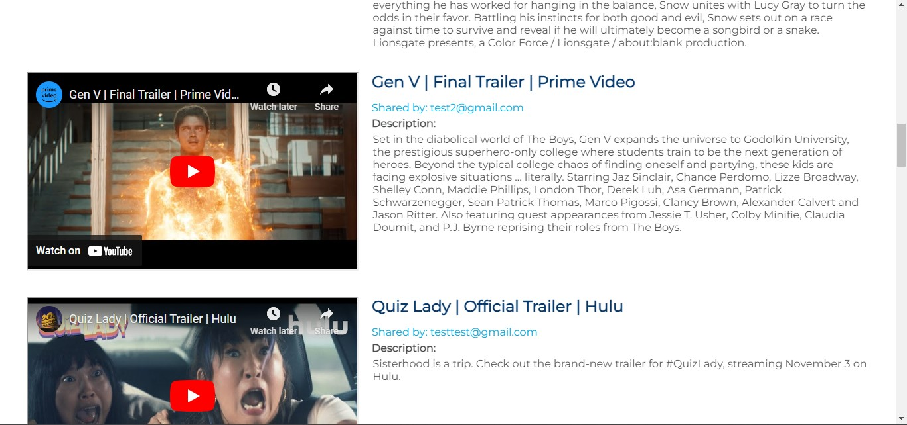

<a name="readme-top"></a>

<br />
<div align="center">

  <h3 align="center">YouTube Url App</h3>

  <p align="center">
    Welcome to Youtube Url APP, a fullstack application.
    <br />
    <a href="https://github.com/Ree-m/youtube-url-app"><strong>Explore the docs »</strong></a>
    <br />
    <br />
    <a href="https://youtube-url-app.vercel.app/">View Demo</a>
    ·
    <a href="https://github.com/Ree-m/youtube-url-app/issues">Report Bug</a>
    ·
    <a href="https://github.com/Ree-m/youtube-url-app/issues">Request Feature</a>
  </p>
</div>

>

<!-- ABOUT THE PROJECT -->

## Introduction

[![YouTube Url App][product-screenshot]](https://github.com/Ree-m/youtube-url-app)

YouTUbe Url App is a full-stack application built using TypeScript and React for the front-end and Express.js and MongoDB for the backend. It is an apllication where users can register and then share youtube videos using youtube urls. Users can then watch the shared videos.
It is full responsive for different devices.

### Prerequisites

- npm
  ```sh
  npm install npm@latest -g
  ```
- node

- MongoDB atlas account

- YouTube API KEY

## Installations & Configuration

Installtion

```sh

  cd youtube-url-app

  cd client

  npm install

  cd ..

  cd server

  npm install

```

Configuration

Add an .env file in root of server folder

```sh
DB_STRING=
PRIVATE_KEY=
ALLOWED_ORIGIN=
PORT=
```

Add .env file in root of client folder

```sh

VITE_API_KEY=
VITE_BACKEND_API_URL=

```

Go to your google cloud console and get the API_KEY.

## DataBase Setup

- Go to MongoDB atlas
- Create a new project
- Create a databse in your project
- Click on the "connect" button and then on the "MongoDB for VS Code"
- Copy your database string and add it to .env

## Running the application

```sh
#In root of the app
cd client
npm run dev

# In the root of another terminal tab
cd server
npm run start

```

### Built With

- [![Node][node.js]][node-url]
- [![React][react.js]][react-url]
- [![Express][express.js]][express-url]
- [![MongoDB][mongodb]][mongodb-url]
- [![JsonWebTokens][jwt]][jwt-url]

## Live Demo

[Live Demo](https://youtube-url-app.vercel.app/)

### Demo Account

email: test@test.com password: test123

<!-- USAGE EXAMPLES -->

## Usage

Users can signup.


Logged in users can share videos



Users can view videos.


<!-- CONTACT -->

## Contact

Reem Bsrat - reembsrat@gmail.com

Project Link: [https://github.com/Ree-m/youtube-url-app](https://github.com/Ree-m/youtube-url-app)

<!-- ACKNOWLEDGMENTS -->

## Acknowledgments

- [React Icons](https://react-icons.github.io/react-icons/search)
- [YouTube Data API](https://developers.google.com/youtube/v3)

[product-screenshot]: client/src/screenshots/youtube-url-home.jpg
[node.js]: https://img.shields.io/badge/Node.js-43853D?style=for-the-badge&logo=node.js&logoColor=white
[node-url]: https://nodejs.org/en
[react.js]: https://img.shields.io/badge/React-20232A?style=for-the-badge&logo=react&logoColor=61DAFB
[react-url]: https://reactjs.org/
[mongodb]: https://img.shields.io/badge/MongoDB-4EA94B?style=for-the-badge&logo=mongodb&logoColor=white
[mongodb-url]: https://www.mongodb.com/docs/atlas/
[express.js]: https://img.shields.io/badge/Express.js-404D59?style=for-the-badge
[express-url]: https://expressjs.com/
[jwt]: https://img.shields.io/badge/json%20web%20tokens-323330?style=for-the-badge&logo=json-web-tokens&logoColor=pink
[jwt-url]: https://jwt.io/
